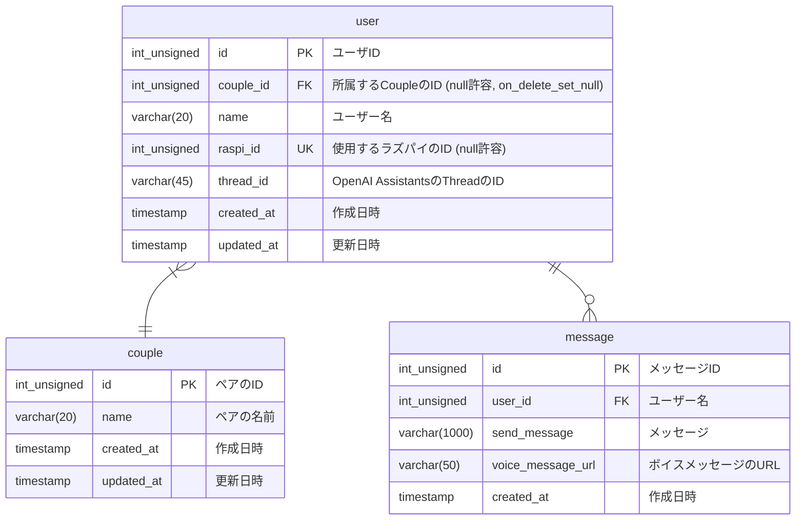

# ER図
以下にER図を示す
## ver. 2024/09/29

```mermaid
erDiagram
    user }|--|| couple : ""
    user ||--o{ message : ""

    user {
        int_unsigned id PK "ユーザID"
        int_unsigned couple_id FK "所属するCoupleのID (null許容, on_delete_set_null)"
        varchar(20) name "ユーザー名"
        int_unsigned raspi_id UK "使用するラズパイのID (null許容)"
        varchar(45) thread_id "OpenAI AssistantsのThreadのID"
        timestamp created_at "作成日時"
        timestamp updated_at "更新日時"
    }

    couple {
        int_unsigned id PK "ペアのID"
        varchar(20) name "ペアの名前"
        timestamp created_at "作成日時"
        timestamp updated_at "更新日時"
    }

    message {
        int_unsigned id PK "メッセージID"
        int_unsigned user_id FK "ユーザー名"
        varchar(1000) send_message "メッセージ"
        varchar(50) voice_message_url "ボイスメッセージのURL"
        timestamp created_at "作成日時"
    }
```
